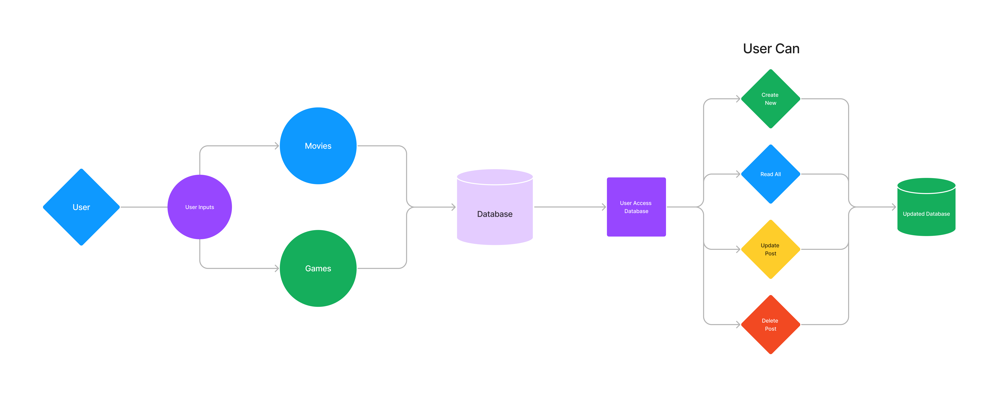

# basic-express-server

LAB - 04
Express

Author: Jonathan Brooks

[Pull Request](https://github.com/jonbrooks01/api-server/pull/8)

[deployed server](https://deployment-practice-main.onrender.com)

Setup
.env requirements:PORT - 3000

Running the app: npm start

Endpoint: Returns Object
Added Github actions:

<!-- {
  "domain": "deployment-practice-main.onrender.com/",
  "status": "{name: name}",
 "port":
} -->
Tests
Unit Tests: npm run test
<!-- Lint Tests: npm run lint -->

Code Review:

[pull request Jonathan](https://github.com/jonbrooks01/api-server/pull/7)

[pull request Raymond](https://github.com/rpruazol/server-deployment-practice/pull/8)

[pull request Christina](https://github.com/Chollie1987/basic-express-server/pull/7)

Christina and Raymond were my partners

I liked to see how the other developers are doing there models and what types of information is need. I also like seeing how each person did their tests and I took some suggestions from them.

UML:

